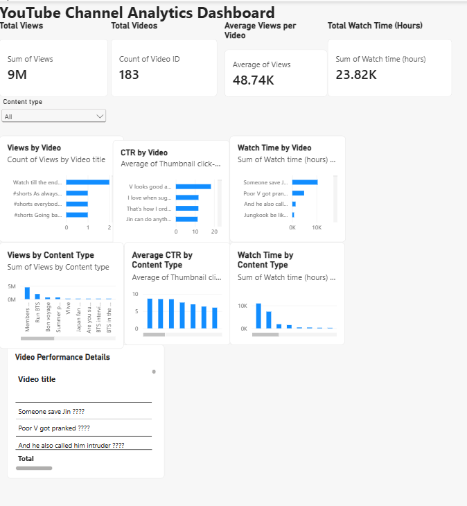

 # YouTube Shorts Performance Analytics

## Project Overview

This project analyzes YouTube Shorts performance using real video-level analytics data from a YouTube channel. The goal is to understand content performance, audience engagement, and the factors associated with higher-performing videos.

The project follows an end-to-end data analytics workflow using Excel for data preparation, MySQL for analysis, and Power BI for interactive visualization.

## Business Questions

* Which videos generate the highest number of views?
* Which content types generate the most total views and watch time?
* How does video duration relate to average views?
* Which videos generate the most subscriber gains?
* How does thumbnail click-through rate (CTR) vary across content types?

## Tools & Technologies

* **Microsoft Excel** — Data cleaning and preparation
* **MySQL** — SQL queries and data analysis
* **Power BI** — Interactive dashboard and data visualization

## Dataset

* **Source:** YouTube Studio
* **Data type:** Video-level YouTube Shorts analytics
* **Number of videos:** 183
* **Key fields:** Video Title, Video ID, Content Type, Duration, Views, Watch Time, Subscribers, Thumbnail Impressions, Thumbnail CTR
* **Preparation:** Data was cleaned and prepared in Excel before being analyzed in MySQL and Power BI.

## Analysis Performed

SQL was used to analyze:

* Top 10 videos by views
* Top 10 videos by subscriber gains
* Views and average views by content type
* Average thumbnail CTR by content type
* Total and average watch time by content type
* Average views across different video-duration groups
* Top-performing videos based on views and thumbnail CTR

## Power BI Dashboard

The Power BI dashboard provides an interactive view of YouTube Shorts performance.


### Dashboard Components

* Total Views
* Total Videos
* Average Views per Video
* Total Watch Time
* Content Type filter
* Views by Video
* Watch Time by Video
* CTR by Video
* Views by Content Type
* Average CTR by Content Type
* Watch Time by Content Type
* Video Performance Details table

## Key Insights

* The dataset contains 183 YouTube Shorts with approximately 9 million total views.
* Average views per video are approximately 48.74K.
* Total recorded watch time across the dataset is approximately 23.82K hours.
* Performance varies across content types when comparing views, watch time, and thumbnail CTR.
* Video duration groups can be compared to identify ranges associated with higher average views.
* Comparing views with subscriber gains helps identify videos that contribute to both reach and channel growth.

## Project Structure

```text
YouTube-Analytics-Project/
│
├── cleaned data.xlsx
├── YouTube_Analytics_Queries_Final.sql
├── YouTube_Analytics_Project.pbix
├── YouTube Analytics Project Documentation.docx
└── README.md
```

### File Descriptions

* `cleaned data.xlsx` — Cleaned dataset used for analysis
* `YouTube_Analytics_Queries_Final.sql` — SQL queries used for data analysis
* `YouTube_Analytics_Project.pbix` — Power BI dashboard
* `YouTube Analytics Project Documentation.docx` — Detailed project documentation
* `README.md` — Project overview and summary

```


